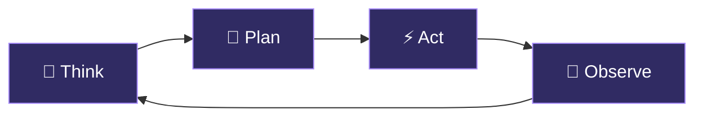

<div align="center">


</div>

<div align="center">

```
╔═══════════════════════════════════════════════════════════╗
║         "Everything is Part of my plan."                  ║
╚═══════════════════════════════════════════════════════════╝
```

[](https://git.io/typing-svg)

</div>

---


### 👾 About Me

```python
agent = SanjayStarc(
  role     = "Agentic AI Engineer",
  mission  = "Automate Everything",
  location = "India 🇮🇳",
  status   = "Always Building...",
  mantra   = "Everything is Part of my plan."
)
agent.execute()
```

<br clear="right"/>

---

## 🧠 Arsenal

<div align="center">

### 🔗 Agentic Frameworks


### 🤖 AI Models & APIs


### ⚙️ Automation Platforms


### 🐍 Engineering


</div>

---

## 🚀 Featured Projects

<div align="center">

| 🧠 Project | 💡 Description | 🛠 Stack |
|:----------:|:-------------:|:--------:|
| [**Multi-Agent Pipeline**](./projects/multi-agent-pipeline/) | Autonomous research & summarization system | LangGraph + Claude |
| [**data-analyst-ultra**](https://github.com/Sanjaystarc/data-analyst-ultra) | AI-powered data analysis powerhouse | Python + OpenAI |
| [**Automation Workflows**](./projects/automation-workflows/) | Business process automation templates | n8n + Make + Zapier |
| [**Custom Python Agent**](./projects/custom-python-agent/) | ReAct agent built from scratch | Python + GPT API |

</div>

---

## 📊 GitHub Stats

<div align="center">


</div>

---

## 🤖 How I Think About Agents

<div align="center">



*The ReAct loop — the heartbeat of every agent I build*

</div>

---

## 💬 Dev Wisdom

<div align="center">

> *"The best automation is the one that runs while you sleep."*

> *"An agent that can't recover from failure isn't an agent — it's a script."*

> *"Prompts are the new code. Write them like it."*

</div>

---

## 🌌 Currently Obsessed With

<div align="center">

| 🔭 Exploring | 📚 Reading | 🛠 Building |
|:---:|:---:|:---:|
| Multi-agent memory systems | Agentic AI papers | Autonomous workflow engine |
| LangGraph human-in-the-loop | Prompt engineering research | Self-healing pipelines |
| Multimodal AI agents | AI safety frameworks | Tool-using agent templates |

</div>

---

<div align="center">

### 🌐 Connect With Me

[](https://github.com/Sanjaystarc)
[](https://linkedin.com/in/sanjaystarc)

---


</div>
